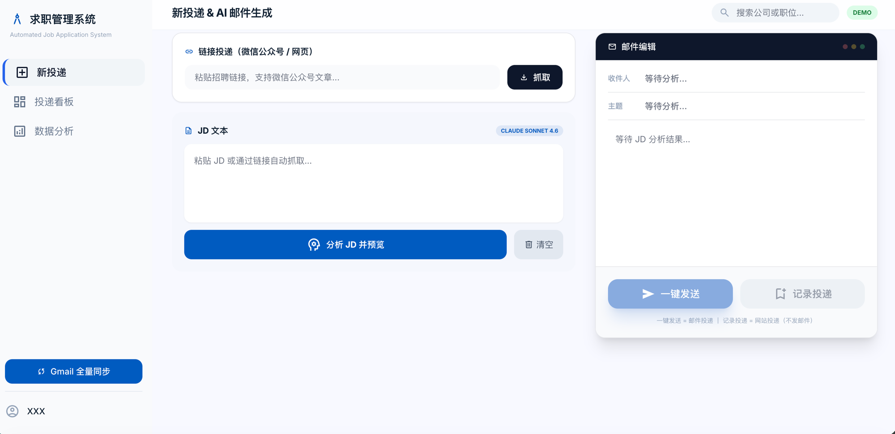
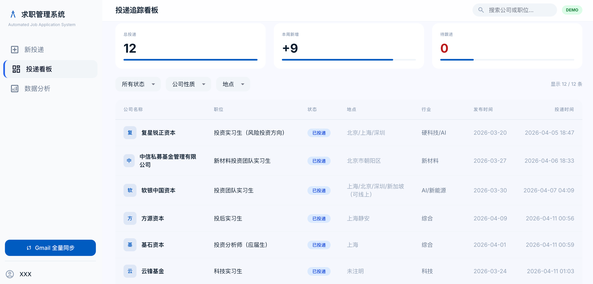
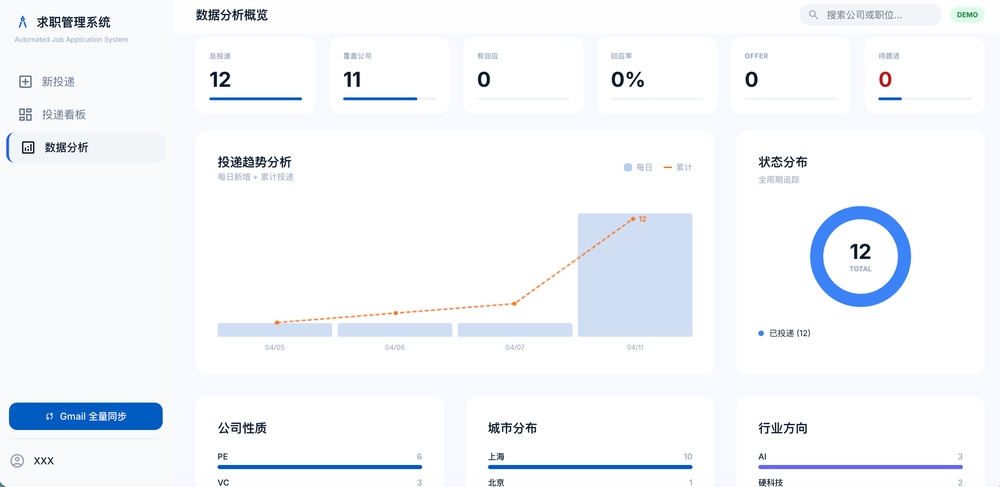

# Job Application Automation System

[](https://www.python.org/)
[](https://flask.palletsprojects.com/)
[](https://www.anthropic.com/)
[](LICENSE)
[](https://yihengz23-ai.github.io/job-apply/demo/)

> 基于 Claude AI + Gmail API 的求职投递自动化系统，将单次投递耗时从 15-20 分钟压缩至约 10 秒。

**[>>> 在线交互演示 (Interactive Demo) <<<](https://yihengz23-ai.github.io/job-apply/demo/)**

## Screenshots

| 新投递 — AI 分析 JD & 邮件编辑 | 投递看板 — 记录管理 & 筛选 | 数据分析 — 趋势 & 分布 |
|:---:|:---:|:---:|
|  |  |  |

## The Problem

PE/VC 实习投递的痛点：

- 每份 JD 要求不同的邮件标题格式（"岗位-姓名-学校-专业-到岗时间"）
- 简历和附件文件名也要按 JD 要求改（每次都不一样）
- 有的要附研究报告，有的不要，有的要求特定命名
- 写完邮件还要手动记录投了哪些公司、什么状态
- JD 散落在微信公众号、官网、Boss 直聘各个平台
- **一次投递从头到尾 15-20 分钟，一天投 10 家就是 3 小时纯重复劳动**

## Features

- **AI 邮件生成** — 粘贴 JD，Claude 自动分析并生成个性化投递邮件（标题、正文全部按 JD 要求格式生成）
- **自动附件命名** — 简历和研究报告按 JD 要求的格式自动重命名（如"岗位-姓名-学校-专业.pdf"），不用每次手动改文件名
- **微信公众号抓取** — 粘贴链接自动抓取 JD 内容，支持图片 OCR（Claude Vision），多岗位自动识别并选择
- **一键发送** — Gmail API 直接发送，邮件预览与实际发送内容完全一致
- **网站投递记录** — 不走邮箱的岗位（飞书/官网）也能记录追踪
- **投递看板** — 全部投递记录可筛选、搜索、编辑状态/来源/行业/备注
- **数据分析** — 投递趋势、状态分布、公司性质/城市/行业分布图表
- **重复检测** — 分析 JD 后自动检测是否已投递过该公司
- **手机适配** — Cloudflare Tunnel 远程访问 + 响应式布局

## Tech Stack

| Component | Technology |
|-----------|-----------|
| AI Engine | Claude API (Sonnet 4.6) |
| Email | Gmail REST API + OAuth 2.0 |
| Backend | Python / Flask |
| Frontend | Tailwind CSS + Vanilla JS |
| Data | JSON (records.json) |
| OCR | Claude Vision API |
| Scraping | BeautifulSoup + lxml |
| Remote Access | Cloudflare Tunnel |

## Quick Start

### Prerequisites

- Python 3.8+
- [Anthropic API Key](https://console.anthropic.com/keys)
- [Google Cloud OAuth Credentials](https://developers.google.com/gmail/api/quickstart/python) (Gmail API)

### Installation

```bash
git clone https://github.com/yihengz23-ai/job-apply.git
cd job-apply

# Install dependencies
pip install -r requirements.txt

# Configure
cp .env.example .env
# Edit .env with your API key and email

# Set up Gmail OAuth
# Place your credentials.json from Google Cloud Console in the project root
# First run will open browser for authorization

# Run
python app.py
# Open http://localhost:5001
```

### CLI Mode

```bash
# Copy JD to clipboard, then:
python apply.py
```

## Project Structure

```
job-apply/
├── apply.py              # Core: Claude API, Gmail API, URL scraping, OCR
├── app.py                # Flask web server + API endpoints
├── templates/
│   └── index.html        # Web dashboard (SPA)
├── demo/
│   └── index.html        # Interactive demo (no backend needed)
├── candidate_profile.md  # Candidate profile template
├── requirements.txt
├── .env.example          # Environment variables template
├── LICENSE
└── README.md
```

## API Endpoints

| Method | Endpoint | Description |
|--------|----------|-------------|
| GET | `/api/records` | List all application records |
| GET | `/api/stats` | Dashboard statistics |
| POST | `/api/fetch-url` | Scrape URL for job descriptions |
| POST | `/api/analyze` | AI analysis of JD |
| POST | `/api/send` | Send application email |
| POST | `/api/record` | Record non-email application |
| POST | `/api/gmail-sync` | Sync sent emails from Gmail |
| PUT | `/api/records/:id` | Update record fields |
| DELETE | `/api/records/:id` | Delete record |

## How It Works

```
1. Input JD (paste text / URL / screenshot OCR)
      ↓
2. Claude AI analyzes: company, position, requirements
      ↓
3. Generates personalized email (subject, body, attachments)
      ↓
4. User reviews & edits in preview panel
      ↓
5. One-click send via Gmail API
      ↓
6. Auto-saved to records.json → Dashboard
```

## Key Technical Challenges Solved

- **WeChat Article OCR**: Public account articles often embed JDs as images. System scans all image URLs from HTML source, downloads each, and uses Claude Vision to extract text — filtering out ads and navigation by keyword detection.
- **Multi-format Email Parsing**: Handles semicolon-separated recipients, various subject format requirements, and automatic placeholder replacement.
- **Smart Deduplication**: Dedup by email address intersection (handles multi-recipient fields).
- **Responsive Design**: Same HTML serves desktop (sidebar + table) and mobile (bottom nav + card list).

## Security

- API keys stored in `.env` (never committed)
- Gmail OAuth tokens stored locally
- No data leaves your machine except API calls
- Cloudflare Tunnel encrypted (HTTPS)

## Customize for Your Own Use

This system is designed to be personalized. To use it for your own job search:

### Step 1: Set Up APIs
```bash
cp .env.example .env
# Add your Anthropic API key and Gmail address
```

### Step 2: Gmail OAuth
1. Go to [Google Cloud Console](https://console.cloud.google.com/)
2. Create a project → Enable Gmail API
3. Create OAuth 2.0 credentials (Desktop app)
4. Download as `credentials.json`, place in project root
5. First run will open browser for authorization

### Step 3: Edit Your Profile
Edit `candidate_profile.md` with your own information:
- **identity**: Your name, email, phone
- **education**: Your schools and degrees
- **experience_rules**: Your internship/work experiences — what to emphasize, what not to exaggerate
- **attachments**: Your resume and optional report file paths
- **email_style**: Tone, structure, greeting and signature rules

The AI will use this profile to generate personalized emails for every JD.

### Step 4: Configure File Paths
In `.env`, set:
- `RESUME_PATH` — path to your resume PDF
- `REPORT_PATH` — path to your research report/writing sample (optional)

### Step 5: Run
```bash
python app.py    # Web dashboard at http://localhost:5001
python apply.py  # CLI mode (reads JD from clipboard)
```

## License

MIT License — see [LICENSE](LICENSE)

## Built With

[Claude Code](https://claude.ai/code) + [Anthropic API](https://www.anthropic.com/) + [Gmail API](https://developers.google.com/gmail/api)
