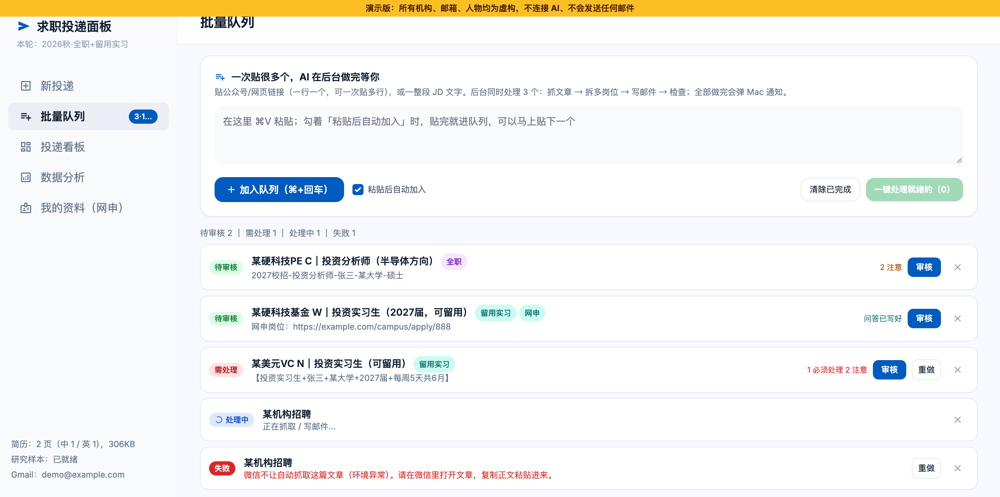
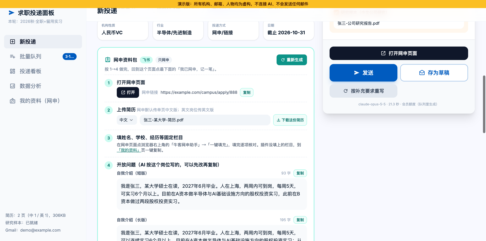

# Job Application Automation System · 求职投递系统

[](https://www.python.org/)
[](https://www.anthropic.com/)
[](https://developers.google.com/gmail/api)
[](LICENSE)
[](https://yihengz23-ai.github.io/job-apply/demo/)

> PE / VC 投递自动化：贴一份 JD（或公众号链接）→ AI 读懂 JD 的每一条格式要求 → 生成标题、正文、附件命名 → **代码层逐项核对** → Gmail 发送或存草稿 → 自动记账、查回复、查退信。网申岗位自动准备「网申资料包」（链接、改好名的单页简历、按岗位写好的问答）。一次可以贴十几个链接，AI 在后台并行做完等你审核。单次投递从 15–20 分钟压缩到约 15 秒。

**[>>> 在线交互演示（虚构数据，不连 AI、不发邮件）<<<](https://yihengz23-ai.github.io/job-apply/demo/)**

| 审核一封：JD 要求 + 邮件 + 发信前检查 | 贴进来：一个或一堆，后台写好一封自动打开一封 | 网申资料包：链接、简历、按岗位写好的问答 |
|:---:|:---:|:---:|
|  |  |  |
| **投递看板：批次 / 类型 / 回复 / 退信** | **数据分析** | |
|  |  | |

## 为什么做

PE/VC 投递的麻烦不在写信，而在**每家要求都不一样**：

- 标题格式五花八门：`【投研实习生+姓名+学校+202X届+每周x天共x月】`、`姓名-学校-毕业时间-最早可入职时间`……
- 简历文件名也要按格式改；有的要中英文简历，有的只要英文；有的要研究报告，有的「可附」
- 实习、留用实习、校招全职，邮件里该写的信息不一样（到岗时间 / 每周天数 / 毕业时间 / 届别）
- 投了几十家之后，谁回了、谁约了面试、哪封被退信，全靠记忆

## 核心设计

**1. AI 只负责「读懂 + 起草」，对错由代码把关。** Claude 用结构化输出（JSON Schema）一次给出：JD 硬性要求（标题格式、命名格式、正文须写信息、所需材料、联系人、截止日期）、岗位类型（全职 / 留用实习 / 实习）、简历版本、文件名和正文。然后由确定性规则逐项检查：

| 检查 | 级别 |
|---|---|
| 收件 / 抄送邮箱必须和 JD 原文**完全一致**（防 AI 编造或抄错；`hr[at]x.com` 这类变形写法提示核对） | 必须处理 |
| 邮箱是从文章**图片**里 OCR 出来的（可能把 rn 认成 m） | 注意 |
| 称呼里的名字必须在 JD 原文里有依据（不许从邮箱前缀猜「X总」） | 自动改成「您好」 |
| 未填占位符 `[期望薪资]`、已从简历删掉的旧经历、写错的毕业时间 | 必须处理 |
| 简历 PDF 里的毕业时间与档案不一致 | 必须处理 |
| 正文出现简历和 JD 都没有的数字、资历词（主导 / CFA / 建模…） | 注意 |
| 以前投过同一邮箱 / 同一域名 / 相近机构名（不拦截，但列出历史） | 注意 |
| JD 硬性条件不符（届别、城市、学历、英文样本…） | 注意 |

**2. 事实和规则分离，单一来源。** `candidate_profile.md` 只放与简历逐条一致的事实；`email_rules.md` 只放写信规则和示例；`candidate_settings.json` 放姓名、文件名、批次等设置。改简历只改这三处，提示词自动重载。

**3. 发出去之后也管。** 每封信记录 Gmail 线程 ID；一键检查回复（含对方另起新邮件约面试的情况），自动识别 **退信 / 自动回复 / 真回复**，发送 90 秒后自动查一次退信。

**4. 数据不丢、不重发。** 记录文件加线程锁 + 文件锁（面板和剪贴板模式同时写也安全）、原子写入、每日备份；文件损坏时拒绝覆盖。队列里的每一条发送前先「认领」，同一封信不会被两个窗口或一键发送重复发出；网络超时这种「不知道发没发出去」的情况，先去 Gmail「已发送」里自动核对，找不到就标成「需处理」请你确认，绝不自动重发；发送中途关掉面板，重启后同样标成「需处理」。界面上每个异步请求回来时都核对「还是不是这一条」，换了条目就丢弃结果，不会把 A 的邮件存进 B。看板每次变动同步一份 Excel（清洗控制字符，`=` 开头的内容按文字存，不当公式执行）。

**5. 网申：不重复造轮子。** 网申表格里的固定栏目（姓名、学校、经历…）交给现成的浏览器插件「牛客网申助手」一键填；面板只做插件做不了的：识别网申平台和步骤、解码文章图片里的二维码链接、按 JD 要求命名的单页中文简历、按岗位写的自我介绍 / 为什么申请 / JD 点名问题（可改、一键复制）、「我的资料」页逐项复制。投完回到面板会问「投完了吗？」，点一下就记进看板，之后按机构名在收件箱里盯笔试 / 面试通知。

## 功能

- **AI 写信**：Claude Opus 5.5 + 结构化输出 + 系统提示缓存（单次约 $0.03）；支持「按补充要求重写」
- **两种调用通道**：Anthropic API Key（按量计费），或本机已登录的 Claude Code（`claude -p` 无界面模式，用 Claude 会员额度）；会员通道失败时自动回退到 API。会员通道一律 `--tools ""` + `--strict-mcp-config`：AI 碰不到本机文件、命令，也碰不到账号里的 Gmail / Drive 等连接器，只能读到你给它的 JD
- **三类岗位**：全职（届别、入职时间）/ 留用实习 / 普通实习，到岗信息只写 JD 问到的
- **简历版本**：中英双页原件 / 只发中文页 / 只发英文页 / 中英各一份，自动按页拆分；网申可一键下载改好名的简历
- **公众号抓取**：正文抓取 + 图片 JD 的 Vision OCR + 图片里二维码的网申链接（macOS Vision）+ 多岗位文章选岗；微信分享的「标题 + 链接」直接贴
- **一个入口**：投一个和投一批是同一个流程。贴链接或 JD，后台 3 个并行（抓取 → 拆岗位 → 写信 → 检查 → 网申岗位顺便写好问答），写好一封就在编辑区自动打开，发完自动跳下一封，全部写完弹系统通知；改动自动保存；检查全过的可一键发送 / 存草稿（每封间隔几秒）；可以给这一批统一指定岗位类型、简历版本、附不附研究样本和给 AI 的补充要求
- **晚上定时发**：北京时间晚上点发送，默认排到第二天 10:00 由面板自己发出（Gmail 接口没有定时发送）
- **图片邮箱自动核对**：JD 是图片时，邮箱由 Claude 和 macOS Vision 各认一遍，对不上再盯着图逐字认一次，三次两次一致才放行
- **网申资料包**：平台识别、投递步骤、二维码链接、单页简历下载、AI 问答（可编辑、一键复制）、「投完了吗？」一键记录；「邮箱 + 网申」两样都要的岗位记在同一条记录上
- **发送或存草稿**：凌晨提醒先存草稿；附件中文名与 Gmail 网页版同编码，各家邮箱不乱码
- **看板 / 分析**：按投递批次、岗位类型、状态、机构性质、城市筛选；回复、退信、待跟进一目了然；网申记录可回看当时填的问答（面试前用）
- **查回复**：邮件看原线程里所有来信 + 对方另起的新邮件（按域名找时要求像招聘邮件）；网申按机构名查收件箱（排除招聘网站推送）；系统确认信算自动回复，面试 / 笔试邀请和人写的回信算真回复；判断错了可以在看板里手动改，改过的不再被覆盖。发信 / 存草稿走不会自动重发的请求，换时区查回复也准
- **剪贴板模式**：复制 JD 或链接 → 双击运行 → 检查全部通过才倒计时自动发送，否则停下来问
- **手机访问**：Cloudflare Tunnel + 访问密钥；只允许本机做 Gmail 授权；防跨站请求、防 DNS rebinding

## 技术栈

| 组件 | 技术 |
|---|---|
| AI | Claude API（Opus 5.5，结构化输出、提示缓存、拒答自动兜底） |
| 邮件 | Gmail REST API + OAuth 2.0 |
| 后端 | Python 3.10+ / Flask |
| 前端 | Tailwind CSS + 原生 JS（单页） |
| PDF | PyMuPDF（按语言拆页、校验简历） |
| 数据 | JSON（原子写入 + 备份）→ Excel 镜像 |
| 抓取 | requests + BeautifulSoup + Claude Vision（OCR）+ macOS Vision（二维码） |

## 目录

```
├── app.py                     # 网页面板（Flask）
├── apply.py                   # 剪贴板一键投递（--dry-run 只生成不发送）
├── jobapply/
│   ├── config.py              # 路径、模型、系统代理
│   ├── llm.py                 # Claude 调用（JD 分析、选岗、OCR、邮件分类）
│   ├── checks.py              # 发信前确定性检查 + 安全自动修正
│   ├── pipeline.py            # 分析 → 检查 → 发送 / 草稿 → 记录
│   ├── gmail_client.py        # 授权、组信、发送、草稿、回复 / 退信检测、同步
│   ├── records.py             # 记录存储、查重、统计、Excel 镜像
│   ├── resume.py              # 简历版本与校验
│   ├── jobqueue.py            # 批量队列（后台并行、认领防重发、中断恢复）
│   └── fetch.py               # 公众号 / 网页抓取、图片 OCR、二维码识别
├── tools/qrdecode.swift       # macOS Vision 二维码识别（首次使用自动编译）
├── templates/index.html       # 面板界面
├── candidate_profile.md       # 候选人事实（示例：虚构人物「张三」）
├── email_rules.md             # 写信规则 + 示例
├── candidate_settings.example.json
├── application_kit.example.json   # 网申表格常用栏目（「我的资料」页）
├── demo/                      # 静态演示：真实界面 + mock.js 虚构数据
├── scripts/                   # Gmail 重新授权、生成演示页
└── tests/                     # pytest
```

## 快速开始

```bash
git clone https://github.com/yihengz23-ai/job-apply.git && cd job-apply
python3 -m venv .venv && .venv/bin/pip install -r requirements.txt
cp .env.example .env                                   # 填 ANTHROPIC_API_KEY
cp candidate_settings.example.json candidate_settings.json
cp application_kit.example.json application_kit.json
# 改 candidate_settings.json / candidate_profile.md / email_rules.md / application_kit.json 为你自己的信息
# 把 Google Cloud 下载的 OAuth 桌面应用凭证存为 credentials.json
.venv/bin/python scripts/gmail_auth.py                 # 首次授权 Gmail
.venv/bin/python app.py                                # 打开 http://localhost:5001
.venv/bin/python -m pytest                             # 跑测试
```

> Google Cloud 的 OAuth 同意屏幕如果停在「测试」状态，刷新令牌 7 天就会失效；个人使用可以把应用发布为「生产」状态。

## License

MIT — see [LICENSE](LICENSE)

## Author

**Yiheng Zhang（章益恒）** — University of Chicago, Harris School of Public Policy

Built with [Claude Code](https://claude.com/claude-code) + [Claude API](https://www.anthropic.com/)
