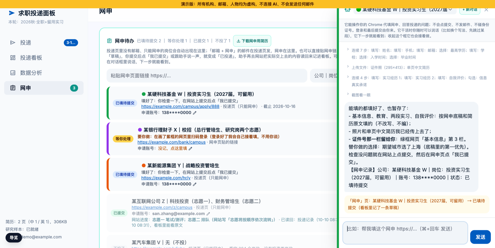
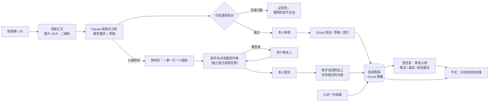
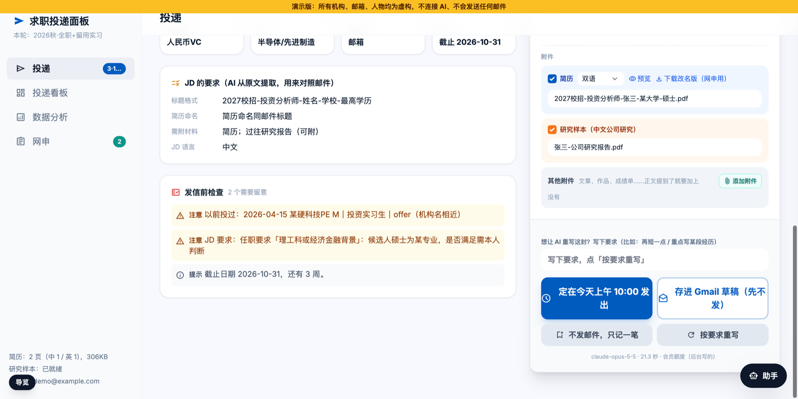
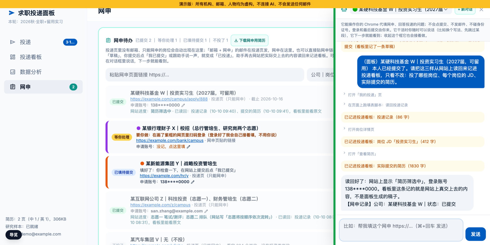
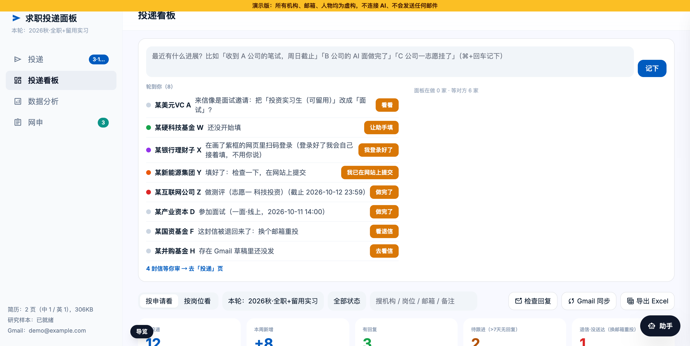
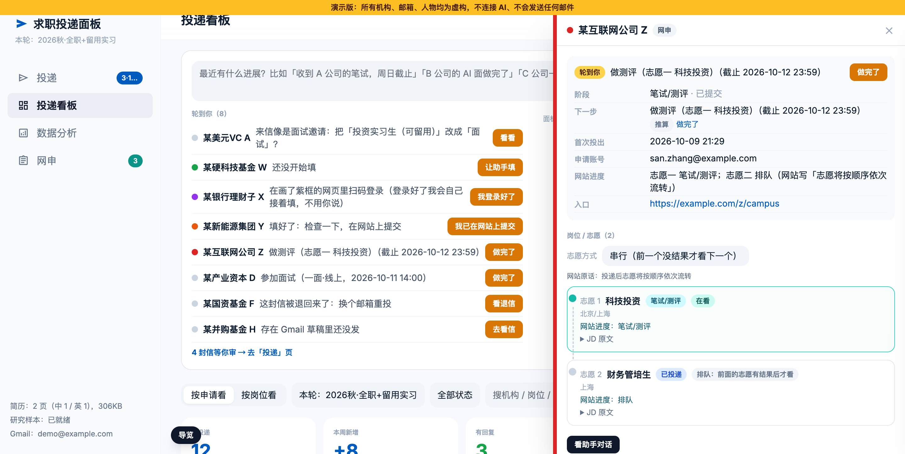

# 求职投递系统 · Job Application Copilot

[](https://www.python.org/)
[](https://www.anthropic.com/)
[](https://developers.google.com/gmail/api)
[](tests/)
[](LICENSE)
[](https://yihengz23-ai.github.io/job-apply/demo/)

**一个人用的求职投递系统，我自己秋招每天在用。** 贴一份 JD 或公众号链接 → AI 读懂格式要求、起草邮件 → **代码逐项核对**（邮箱必须出现在 JD 原文里、占位没填不许发……）→ 发送或定时发送；只能网申的岗位，交给面板里的**助手在浏览器里代填**，本人提交后它把网站上**实际提交的内容读回来**记进看板；之后的笔试、面试、拒信从来信里认，或者随口说一句记下来，看板顶上只列「轮到你」的事。全程 AI 只负责起草和操作，最后一下由人点。

> *A personal job-application system I use daily: Claude drafts tailored emails from each JD, deterministic code checks every hard requirement before anything is sent, a browser agent fills online application forms (the human always clicks submit), and the tracker stores what was actually submitted — read back from the website, not what the AI drafted. Applications are grouped per company (serial vs. parallel volunteer choices), progress is captured from incoming email or a one-line note, and a "Today" list shows only what's waiting on the human.*

### **[>>> 在线演示：打开就能点（虚构数据，不连 AI、不发邮件）<<<](https://yihengz23-ai.github.io/job-apply/demo/)**

演示里建议先做两件事：① 在「网申」页点「某硬科技基金 W」那行的 **让助手填**，右下角看助手一步步填表（证件号那栏空着，留给你自己填）；填好后点 **我已提交**，看它去网站读回实际提交的内容。② 在「投递」页看 AI 写的信和右边的**发信前检查**。③ 在「投递看板」顶上的口述框里说一句「收到某硬科技PE C的笔试，周日截止」，看它记进那一家；点「某互联网公司 Z」看串行志愿。



---

## 30 秒看懂

| | 做什么 | 关键设计 |
|---|---|---|
| **写邮件** | 贴链接或 JD（一次可以贴十几个），后台并行写好一封打开一封，人审核后发送 / 存草稿 / 定时发 | AI 用结构化输出给出 JD 的硬性要求和草稿；**发不发由代码决定**：十几项确定性检查，硬问题点「仍然发送」也发不出去 |
| **网申** | 只能网申的岗位，面板里的助手（Claude Code + Claude in Chrome）在你自己的浏览器里代填 | 一家一个网页、一个颜色框；要登录就停下等你；照片自己传、**证件号那栏空着本人自己填**、**最后提交本人点**；提交后读回网站上真交上去的内容 |
| **跟进** | 看板顶上「今天」只列轮到你的事；一行一次申请（同一家的几个志愿一张卡）；来信自动认出笔试 / 面试 / 拒信，口述一句也能记 | 自动识别的**只当建议**，本人点了才改；口述每句可撤销；网申记录存的是**从网站读回的原文**；状态只往前推，投递时间只写一次 |

写一封按 JD 格式定制的信：手工 15–20 分钟 → 后台约 20 秒写好，人只负责审核。

## 为什么做

PE / VC / 战投的投递，麻烦不在「写」，而在**每家要求都不一样、而且量大**：

- 标题格式五花八门：`【投研实习生+姓名+学校+202X届+每周x天共x月】`、`姓名-学校-毕业时间-最早可入职时间`……简历文件名也要跟着改；
- 实习、留用实习、校招全职，邮件里该交代的信息不一样（到岗时间 / 每周天数 / 届别）；
- 大公司、银行只收网申：几十个网站、每个都要从头填一遍，还有登录、验证码、志愿顺序；
- 投了几十家以后，谁回了、谁约了笔试面试、哪封被退信、在网站上到底交了什么，全靠记忆。

## 怎么工作


```mermaid
flowchart LR
    A[贴链接 / JD] --> B[抓取正文<br/>图片 OCR · 二维码]
    B --> C[Claude 结构化分析<br/>硬性要求 + 草稿]
    C --> D{代码逐项核对}
    D -- 有硬问题 --> E[必须改，<br/>强制也发不出去]
    D -- 通过 --> F[本人审核]
    F --> G[Gmail 发送 / 草稿 / 定时]
    G --> H[(投递看板<br/>+ Excel 镜像)]
    C -- 只能网申 --> I[网申页：一家一行一个颜色]
    I --> J[助手在浏览器里代填<br/>（独立宿主进程托管）]
    J -- 要登录 --> K[停下等本人]
    K --> J
    J --> L[本人提交]
    L --> M[助手读回网站上<br/>实际提交的内容]
    M --> H
    H --> N[查回复：来信认成<br/>笔试 / 面试 / 拒信建议]
    O[口述一句进展] --> H
    N --> P[今天：只列轮到你的事]
    H --> P
```

### 1. 写邮件：AI 起草，代码把关

Claude 用 JSON Schema 结构化输出，一次给出：JD 的硬性要求（标题格式、简历命名、正文必须交代的信息、需附材料、联系人、截止日期）、岗位类型、简历版本和草稿。然后由确定性规则逐项检查：

| 检查 | 级别 |
|---|---|
| 收件 / 抄送邮箱必须和 JD 原文**完全一致**（防 AI 编造或抄错）；图片里的邮箱 Claude 和 macOS Vision 各认一遍，对不上不放行 | 硬问题 |
| 未填占位 `[期望薪资]`、写错的毕业时间、简历上没有的经历、收件人是自己、标题为空、正文说附了但附件里没有 | 硬问题（强制发送也跳不过） |
| 简历 PDF 里的毕业时间和档案对不上 | 硬问题 |
| 称呼里的名字必须在 JD 原文里有依据（不从邮箱前缀猜「X 总」） | 自动改成「您好」 |
| 正文出现简历和 JD 里都没有的数字、资历词（主导 / CFA / 建模……） | 注意 |
| 以前投过同一邮箱 / 同一域名 / 相近机构 | 注意（列出历史，不拦） |

另外：晚上点发送默认排到第二天 10:00 由面板自己发；发送前先「认领」，同一封信不会被两个窗口发两次；网络超时这种「不知道发没发出去」的情况，先去 Gmail「已发送」里核对，绝不自动重发。



### 2. 网申：面板里的助手代填

只能网申的岗位自动进「网申」页，一家一行、一个颜色。点「让助手填」，面板起一个 Claude Code 进程（带 Claude in Chrome），在**本人自己的浏览器**里填表：

- **一家一个网页、一个颜色框**：助手在网页四周画上和面板这一行同色的框，几家同时填也分得清哪个网页是哪个对话在填；
- **填表靠脚本，不靠截图猜**：`wsfill.js` 认得常见招聘系统的表单组件（Moka、antd、Element UI，以及大厂自研的组件库……；新网站的坑记进网站笔记），按「网申底稿」逐栏填，日期、下拉、级联都处理；
- **只在真正需要本人时停下**：要登录就请本人在框住的网页里登录，**留在这一轮里等**，登录好了自己接着填；照片、单页简历自己传；**证件号那栏空着不碰，本人自己填，也不为它停**；**最后的提交按钮本人点**；
- **报状态有固定格式**：助手每次停下都写一行 `【网申记录】……｜状态：已填待提交 / 等你处理`，面板据此更新这一行和看板，「要你做」只认助手明确写出的那句；
- **提交后读回**：本人点「我已提交」，助手去网站把投了哪些岗位、每个岗位的 JD、实际提交的简历读回来（证件号自动打码），看板里存的就是网站上真交上去的版本。



助手的权限是收紧过的：只放行浏览器工具；读文件只许读「网申上传」文件夹；上传文件经过 PreToolUse 钩子校验，只许传这个文件夹里的照片和简历；不给关标签页（关掉组里最后一个标签页会丢整个标签组）；不带 API Key、不带本机的其他 Claude 会话变量和长期记忆。

### 3. 跟进：今天、按申请看、口述进展、邮件识别



- **一行 = 一次申请**：同一家一起投的几个岗位 / 志愿合成一张卡。串行志愿（网站写「志愿将按顺序依次流转」）显示「在看 / 排队 / 已流转」，平行的列出各阶段几个。点开是这家的详情：志愿链、每个岗位的 JD 和网站进度、时间线、从网站读回的原文；
- **今天**：只列轮到你的事——审信、登录、提交、做测评、看退信——每条一个按钮，按钮上的字就是点了会发生什么（「我已在网站上提交」「做完了」「我登录好了」）；
- **口述进展**：网申平台的笔试、测评、AI 面通知很多只发短信。随口说一句「收到 A 公司的笔试，周日截止」「B 基金一面面完了」，Claude 拆成事件、对上是哪一家：阶段往前推、截止写进下一步、时间线记原话；对不上的列出候选让本人点；**每一句都能撤销**。记错了也用一句话改（「那封不是拒信，是笔试，13 号截止」「把 B 证券改回已投递」），在右下角助手对话里说也行；详情里也能手动改阶段、下一步和建议；
- **邮件识别**：查回复时从来信里认出笔试 / 测评 / AI 面 / 面试邀请、拒信、offer 和截止时间（「请于 10 月 12 日前完成」「48 小时内」）——**自动识别的只当建议**，本人点「采纳」才改阶段；「通过筛选者将收到通知」这种条件句不算邀请；退信直接算轮到你；
- **证件号**：面板不存，助手不碰。证件号那栏空着，助手把别的都填完，收尾说一句「证件号空着，你自己填」，不为它停下来；只有网站不填证件号就进不了下一步时才停下等，只看这一栏「填了没有」（读不到号码），填了自己接着做。




更早的功能照旧：

- 「按岗位看」：按批次、岗位类型、状态、机构性质、城市筛选，点开看邮件原文和 JD；
- 查回复：邮件看原线程里所有来信 + 对方另起的新邮件；网申按机构名查收件箱（排除招聘网站推送）；白天每两小时自动查一次本轮的；判断错了可以手动改，改过的不再被覆盖；
- 每次变动同步一份 Excel 镜像（控制字符清洗，`=` 开头按文字存；手机号中间四位打码）。


## 可靠性

这是每天在用的工具，出错的代价是「信发错了」「网申白填了」，所以可靠性是按「数据不能丢、信不能重发、助手不能断」来设计的：

- **助手不随面板断**：每个助手进程交给一个独立的小宿主进程托管（自己一个会话），面板重启、甚至被 `kill -9`，助手和它开的网页都还在；面板起来后从记下的位置接着读输出，消息不重也不丢（有测试：强杀面板后再起来，还是原来的进程）；
- **「停下」只停这一轮**：用 stream-json 的中断请求，不杀进程（杀进程它开的网页就失控了，银行网站还得重新登录）；
- **状态只往前推**：已提交、不投了是终态，助手的上报只能补账号和进度；投递时间只写一次，笔试、面试中不会被改回已投递；自动识别的进展只当建议，本人点了才改；
- **数据升级可退回**：从「一条投递一行」升级到「申请 + 岗位」时只建申请、给记录挂编号，别的一个字节不改；升级前整包备份、升级后逐条核对，核对不过自动退回；同一份输入跑两次结果逐字节相同；上线脚本在真实数据的副本上完整演练过（含重复跑）；
- **数据**：线程锁 + 文件锁 + 原子写入，文件损坏时拒绝覆盖；滚动备份；不认识的顶层数据原样保留；
- **测试**：562 个 pytest，覆盖检查规则、发信认领、定时发送、网申状态流转、读回、助手宿主（用假的 claude 进程端到端跑）、申请 + 岗位的数据模型和护栏、口述进展和撤销、来信识别、证件号不外露、前端脚本按页面顺序加载、填表脚本静态检查；测试一律在隔离目录里跑，**守卫测试**保证测试不碰真实数据，碰了就判失败；
- **测试环境**：`JOBAPPLY_ENV=test` 起在 5002 端口，独立数据目录、假的 claude、不连 Gmail、不开定时发送，随便点不会碰到正在用的面板。

## 隐私（这个公开仓库）

- 这里是**脱敏的公开版**：代码和我自己用的一样，人物、机构、邮箱、账号全部虚构（候选人「张三」、「A 资本」……）；简历、投递记录、令牌、网申底稿都不在仓库里；
- 每次推送前跑隐私扫描：真实姓名 / 学校 / 实习单位等关键词，**18 位身份证号（核对校验位）、11 位手机号、打码的手机号**——扫描不过就不推；
- 网申读回的原文里，证件号在存进看板之前就打码。

## 技术栈

| 组件 | 技术 |
|---|---|
| AI | Claude（Opus 5.5）：结构化输出写信、OCR、分类；Claude Code 无界面模式 + Claude in Chrome 做网申助手 |
| 调用通道 | 本机已登录的 Claude Code（会员额度），或 Anthropic API Key（按量）；会员通道失败自动回退 |
| 邮件 | Gmail REST API + OAuth 2.0 |
| 后端 | Python 3.10+ / Flask；助手宿主进程（文件通道：in.jsonl / out.jsonl） |
| 前端 | Tailwind CSS + 原生 JS（单页） |
| 网申填表 | `wsfill.js`（注入到网申页面里跑的填表 / 读回脚本） |
| PDF / 图片 | PyMuPDF（按语言拆页、校验简历）；macOS Vision（OCR、二维码）；sips（照片规格） |
| 数据 | JSON（锁 + 原子写入 + 滚动备份）→ Excel 镜像 |

## 目录

```
├── app.py                     # 网页面板（Flask）
├── apply.py                   # 剪贴板模式（--dry-run 只生成不发送）
├── wsfill.js                  # 网申填表 / 读回脚本（助手在网申页面里加载）
├── wangshen_rules.md          # 网申助手的规则（唯一一份）
├── jobapply/
│   ├── llm.py                 # Claude 调用（JD 分析、写信、OCR、分类）
│   ├── checks.py              # 发信前确定性检查（含强制发送也跳不过的硬问题）
│   ├── pipeline.py            # 分析 → 检查 → 发送 / 草稿 → 记录
│   ├── jobqueue.py            # 批量队列：后台并行、认领防重发、定时发送、中断恢复
│   ├── gmail_client.py        # 授权、组信、发送、草稿、查回复 / 退信
│   ├── records.py             # 投递记录（岗位）、查重、统计、Excel 镜像
│   ├── apps.py                # 申请（一次投出）：阶段只往前推、首次投出只写一次、颜色、轮到谁、建议、时间线
│   ├── app_api.py             # 看板数据：按申请成组、串行志愿、今天、单家详情
│   ├── progress.py            # 口述进展：结构化拆事件、对上申请、可撤销
│   ├── backup.py / notify.py  # 滚动备份 / Mac 通知（夜里静默、去重）
│   ├── web/                   # 接口按功能拆的 Flask 蓝图（拦截、防跨站统一挂在整个面板上）
│   ├── wstasks.py             # 网申待办：状态流转、【网申记录】解析、读回、多岗位
│   ├── agent.py               # 面板里的助手：对话、并行与排队、同站锁、寿命
│   ├── agent_host.py          # 助手宿主：claude 进程脱离面板（面板重启不断）
│   ├── agent_runner.py        # 宿主托管 / 面板直起两种跑法，接口一致
│   ├── upload_guard.py        # 上传钩子：只许传「网申上传」文件夹里的文件
│   ├── uploads.py             # 照片规格自动生成、单页简历
│   ├── wsprofile.py           # 网申底稿（简历以外的个人信息）
│   └── fetch.py               # 公众号 / 网页抓取、图片 OCR、二维码
├── templates/                 # 面板界面：index.html 外壳 + pages/ 各页片段
├── static/                    # 前端脚本按页拆开（core / board / apps / mail / ws / agent / profile / analytics）
├── demo/                      # 在线演示：真实界面 + mock.js 虚构数据和剧本
├── scripts/                   # 启动 / 管理面板、Gmail 授权、生成演示页
└── tests/                     # pytest（含假的 claude 进程 fake_claude.py）
```

## 快速开始

```bash
git clone https://github.com/yihengz23-ai/job-apply.git && cd job-apply
python3 -m venv .venv && .venv/bin/pip install -r requirements.txt
cp candidate_settings.example.json candidate_settings.json
cp application_kit.example.json application_kit.json
cp wangshen_profile.example.json wangshen_profile.json
# 把这几份和 candidate_profile.md、email_rules.md 换成你自己的信息

JOBAPPLY_ENV=test scripts/panel.sh      # 先在测试环境里点点看：5002 端口、假助手、不连 Gmail
.venv/bin/python -m pytest              # 跑测试

# 真用：把 Google Cloud 的 OAuth 桌面应用凭证存为 credentials.json
.venv/bin/python scripts/gmail_auth.py  # 首次授权 Gmail
scripts/panel.sh                        # 打开 http://localhost:5001（面板在后台运行，重复打开不会重启它）
```

写信默认用本机已登录的 Claude Code（`claude -p`）；也可以在 `.env` 里放 `ANTHROPIC_API_KEY` 走 API。网申助手需要 Claude Code + Claude in Chrome 扩展。

## 接下来

- **资料三方比对**：本人在网站上改过的内容、提交前的填写稿、网申底稿对一遍，差异让本人选「用网站的 / 保持底稿 / 只这家这样」；
- **网申数据全部并进申请**：去掉现在的过渡同步层，网申页和看板看的是同一份数据；
- **今天单独一页**：手机上打开就是要做的事。

## License

MIT — see [LICENSE](LICENSE)

## Author

**Yiheng Zhang（章益恒）** — University of Chicago, Harris School of Public Policy

Built with [Claude Code](https://claude.com/claude-code) + [Claude API](https://www.anthropic.com/)
